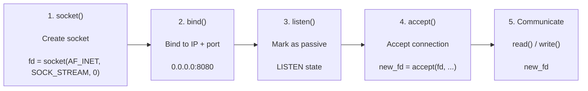
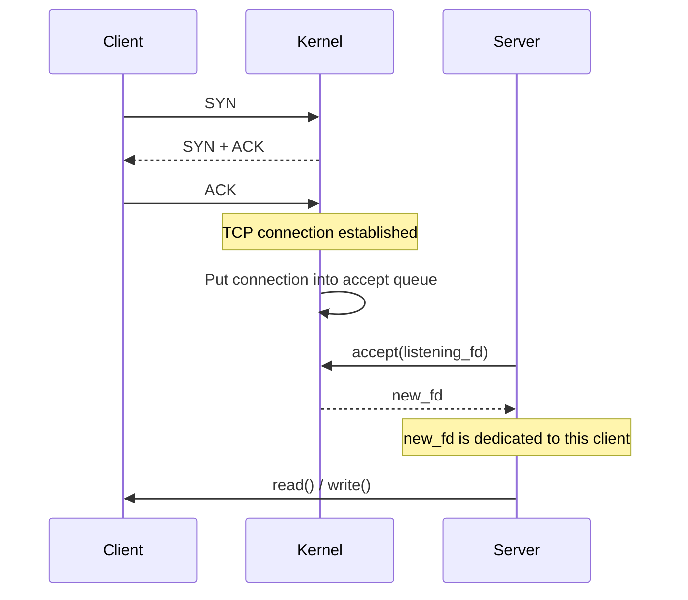
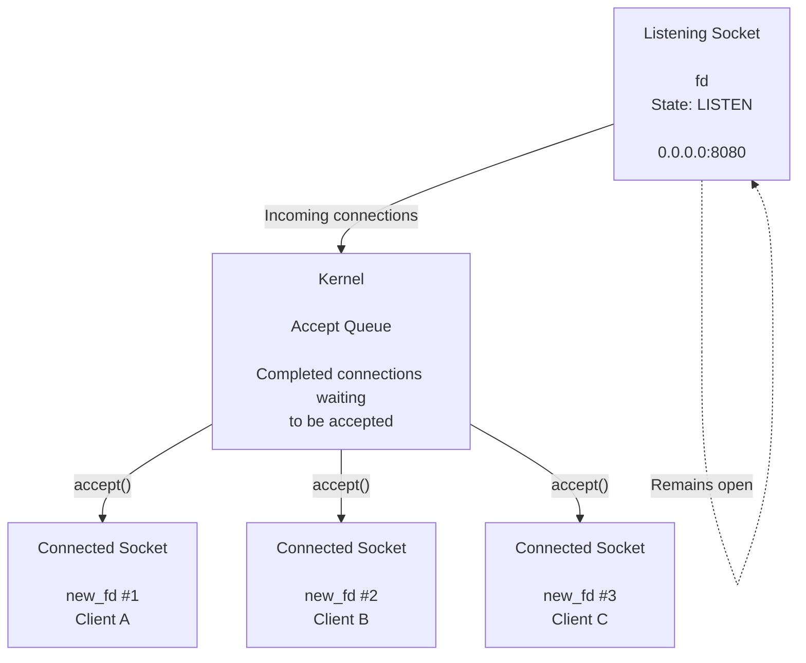
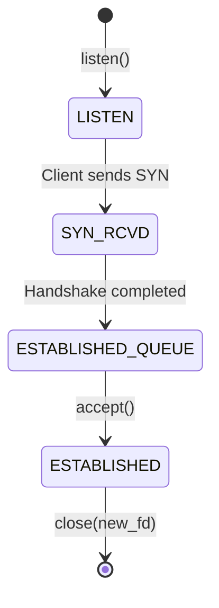

# ft_irc

`ft_irc` is a custom Internet Relay Chat (IRC) server developed in C++98 . The project aims to recreate the core functionality of an IRC server while adhering to the IRC protocol, enabling multiple clients to communicate in real time through channels and private messages.

The server is designed to be compatible with standard IRC clients, handling client connections, authentication, channel management, user commands, and message broadcasting while emphasizing socket programming, network communication, and object-oriented design.


# TCP Listening Socket

A **TCP listening socket** is a passive socket used by a server to wait for incoming client connections.

## Server Socket Setup



---

# What Happens When a Client Connects?

The important thing to understand is that **the listening socket does not communicate with the client**.

It only waits for connections.



---

# Listening Socket vs Connected Socket

This distinction is **very important**.



The key idea is:

```text
                 SERVER

        ┌─────────────────────┐
        │  Listening Socket   │
        │         fd          │
        │      LISTEN         │
        │     port 8080       │
        └──────────┬──────────┘
                   │
                   │ incoming connections
                   ▼
        ┌─────────────────────┐
        │     Accept Queue    │
        │                     │
        │  [client A]         │
        │  [client B]         │
        │  [client C]         │
        └──────────┬──────────┘
                   │
                 accept()
                   │
          ┌────────┼────────┐
          ▼        ▼        ▼
       new_fd1  new_fd2  new_fd3
          │        │        │
       Client A Client B Client C
```

---

# TCP Three-Way Handshake

The handshake happens **before the server receives the connection through `accept()`**.

```text
Client                         Server

   │                              │
   │────────── SYN ──────────────>│
   │                              │
   │<────── SYN + ACK ────────────│
   │                              │
   │────────── ACK ──────────────>│
   │                              │
   │       Connection established │
   │                              │
   │                              │
   │                    Accept Queue
   │                         │
   │                         ▼
   │                      accept()
   │                         │
   │                         ▼
   │                       new_fd
   │                              │
   │<─────── data ───────────────>│
```

The **kernel handles the TCP handshake**.

Your server application normally does not manually send the SYN/SYN-ACK/ACK.

---

# Typical Socket States




# Key Characteristics

| Characteristic                  | Meaning                                                          |
| ------------------------------- | ---------------------------------------------------------------- |
| **Passive**                     | The listening socket waits for incoming connections.             |
| **LISTEN state**                | `listen()` puts the socket into listening mode.                  |
| **Accept queue**                | Completed connections wait here until `accept()` retrieves them. |
| **New socket per client**       | Every successful `accept()` returns a new connected socket.      |
| **Listening socket stays open** | The original socket continues accepting new clients.             |
| **Same port, many clients**     | Multiple clients can connect through the same listening port.    |
| **Kernel handles handshake**    | TCP's three-way handshake is handled by the OS kernel.           |

---
